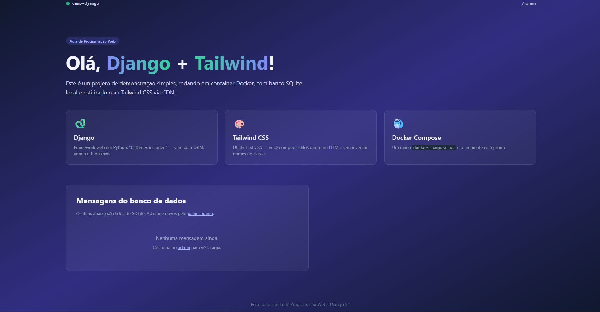

# demo-django: Parte 1

**Disciplina:** BCC481 - Programação Web

**Aluna:** Brenda Gabrielle Alves Nascimento

**Matrícula:** 24.1.4011

Site de uma página em Django 5.1, estilizado com Tailwind CSS (CDN), banco SQLite e executado com Docker Compose.

## Tecnologias

- Django 5.1
- Tailwind CSS via CDN
- SQLite
- Docker e Docker Compose

## Como rodar

~~~bash
docker compose up --build
~~~

Acesse http://localhost:8000 e o painel administrativo em http://localhost:8000/admin/.

Para criar o usuário admin, com o servidor rodando, em outro terminal:

~~~bash
docker compose exec web python manage.py createsuperuser
~~~

## Estrutura

- `core/`: configurações e rotas principais do projeto
- `home/`: app com o modelo `Mensagem`, a view `index` e as rotas
- `templates/home/index.html`: página inicial com Tailwind
- `docs/`: imagens do README

## Partes do trabalho

Cada parte está em uma branch separada:

- `bcc481-django-parte1`: estrutura do projeto, modelo `Mensagem`, admin, view, rotas e template
