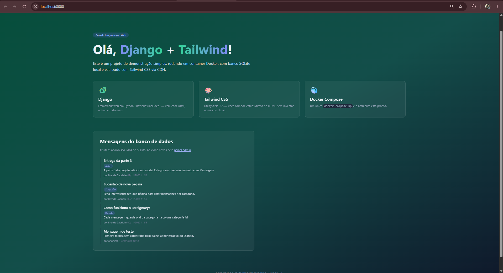
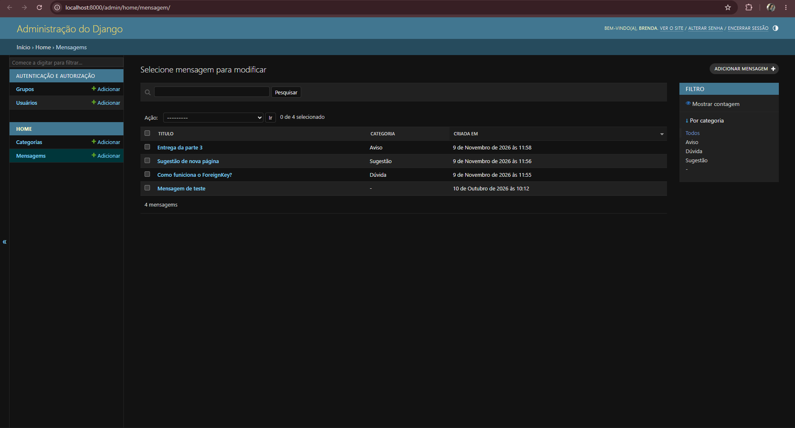

# demo-django: Parte 3

**Disciplina:** BCC481 - Programação Web

**Aluna:** Brenda Gabrielle Alves Nascimento

**Matrícula:** 24.1.4011

Site em Django 5.1, estilizado com Tailwind CSS (CDN), banco SQLite e executado com Docker Compose.

## Página inicial

## Admin com categorias

## O que mudou nesta parte

- Novo model `Categoria`
- Relacionamento um-para-muitos: cada `Mensagem` pertence a uma `Categoria` (`ForeignKey`)
- `Categoria` registrada no admin, com coluna e filtro por categoria na lista de mensagens
- Selo da categoria exibido em cada mensagem da página inicial

## Tecnologias

- Django 5.1
- Tailwind CSS via CDN
- SQLite
- Docker e Docker Compose

## Como rodar

~~~bash
docker compose up --build
~~~

Acesse http://localhost:8000, a página sobre em http://localhost:8000/sobre/ e o painel administrativo em http://localhost:8000/admin/.

Para criar o usuário admin, com o servidor rodando, em outro terminal:

~~~bash
docker compose exec web python manage.py createsuperuser
~~~

## Estrutura

- `core/`: configurações e rotas principais do projeto
- `home/`: app com os models `Categoria` e `Mensagem`, as views `index` e `sobre` e as rotas
- `templates/home/index.html`: página inicial com Tailwind
- `templates/home/sobre.html`: página sobre
- `docs/`: imagens do README

## Partes do trabalho

Cada parte está em uma branch separada:

- `bcc481-django-parte1`: estrutura do projeto, modelo `Mensagem`, admin, view, rotas e template
- `bcc481-django-parte2`: campo `autor`, página `/sobre/`, link no menu e novo visual
- `bcc481-django-parte3`: model `Categoria` e relacionamento um-para-muitos com `Mensagem`
