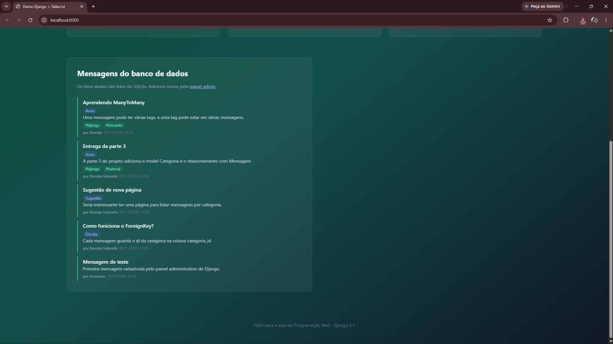
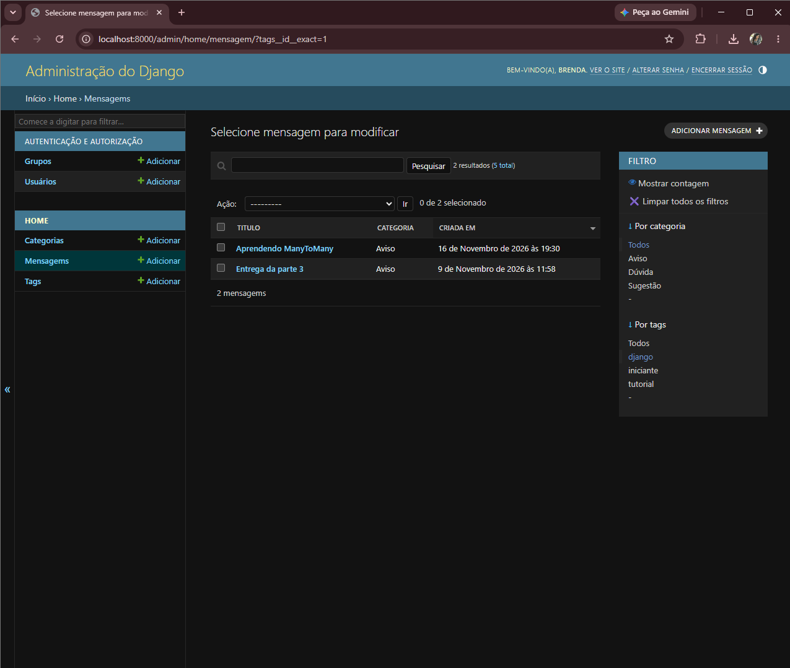

# demo-django: Parte 4

**Disciplina:** BCC481 - Programação Web

**Aluna:** Brenda Gabrielle Alves Nascimento

**Matrícula:** 24.1.4011

Site em Django 5.1, estilizado com Tailwind CSS (CDN), banco SQLite e executado com Docker Compose.

## Página inicial

## Admin com tags

## O que mudou nesta parte

- Novo model `Tag` (`SlugField`, único)
- Relacionamento muitos-para-muitos: cada `Mensagem` pode ter várias `Tag` e vice-versa (`ManyToManyField`), com tabela de junção `home_mensagem_tags`
- `Tag` registrada no admin; filtro por tag e seletor `filter_horizontal` na edição de mensagens
- Tags inseridas pelo shell do Django usando o ORM (`get_or_create`, `add`, `set`, `remove`)
- Tags exibidas como `#tag` em cada mensagem da página inicial

## Tecnologias

- Django 5.1
- Tailwind CSS via CDN
- SQLite
- Docker e Docker Compose

## Como rodar

~~~bash
docker compose up --build
~~~

Acesse http://localhost:8000, a página sobre em http://localhost:8000/sobre/ e o painel administrativo em http://localhost:8000/admin/.

Para criar o usuário admin, com o servidor rodando, em outro terminal:

~~~bash
docker compose exec web python manage.py createsuperuser
~~~

## Estrutura

- `core/`: configurações e rotas principais do projeto
- `home/`: app com os models `Categoria`, `Tag` e `Mensagem`, as views `index` e `sobre` e as rotas
- `templates/home/index.html`: página inicial com Tailwind
- `templates/home/sobre.html`: página sobre
- `docs/`: imagens do README

## Partes do trabalho

Cada parte está em uma branch separada:

- `bcc481-django-parte1`: estrutura do projeto, modelo `Mensagem`, admin, view, rotas e template
- `bcc481-django-parte2`: campo `autor`, página `/sobre/`, link no menu e novo visual
- `bcc481-django-parte3`: model `Categoria` e relacionamento um-para-muitos com `Mensagem`
- `bcc481-django-parte4`: model `Tag`, relacionamento muitos-para-muitos com `Mensagem` e inserção de dados pelo shell
